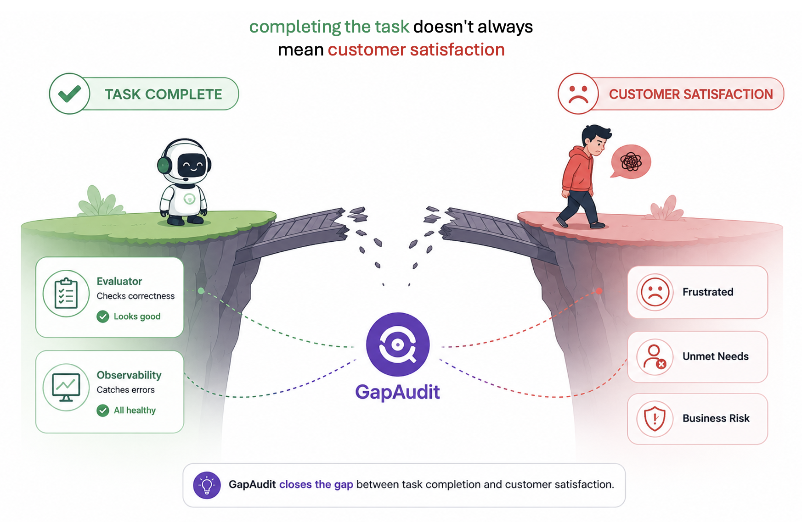
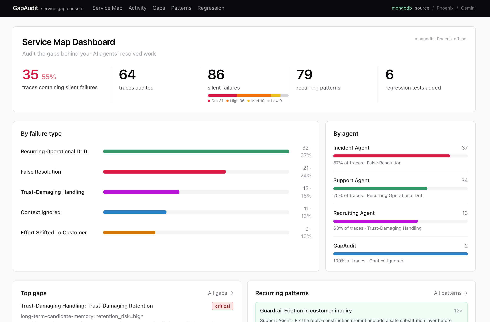

# GapAudit

**Audit the service gaps your AI agents leave behind.**



GapAudit is a customer experience audit dashboard for AI agents. It finds where customer-facing agents completed the task, closed the ticket, or marked the workflow resolved, but still failed the customer.

Task completion is a system status. Service success is a customer outcome. GapAudit finds the gap between them.

### Links

- **Live demo:** https://gap-audit-rust.vercel.app/
- **Demo video:** https://www.youtube.com/watch?v=DL-9cQSoQ7M



## What It Is

GapAudit is a post-hoc service experience audit layer for AI support and operations agents.

It ingests traces from agent runs, maps them into service audit artifacts, and uses a Gemini-powered audit agent to surface hidden service gaps: cases where the system recorded success while the customer or downstream operator experienced frustration, repeat contact, escalation pressure, unresolved work, or trust loss.

GapAudit combines three kinds of evidence:

- **Conversation signals**: human requests, frustration, repeated information, "already tried", self-service loops, negative feedback.
- **Operational signals**: resolved status, failed tools, missing verification, handoff quality, irreversible external actions, repeated guardrail events.
- **Business signals**: repeat contact, low CSAT, thumbs down, churn intent, escalation-after-resolution, containment hiding dissatisfaction.

## What It Is Not

- **Not a Phoenix replacement.** Arize Phoenix remains the trace, span, evaluation, and experiment system of record.
- **Not another task-solved evaluator.** GapAudit does not simply judge whether a known task was completed.
- **Not a generic LLM judge.** It investigates customer experience risk using traces, service status, tool outcomes, operational metadata, and history.
- **Not a runtime blocker.** GapAudit reviews what happened after the agent completes work.
- **Not a full-context inspector.** It does not inspect hidden reasoning, private chain-of-thought, or full system prompts.
- **Not a redaction product.** Upstream systems should handle raw-data controls. GapAudit can treat retention and exposure as trust signals, but its core job is service-gap audit.
- **Not a single satisfaction score.** Satisfaction is contextual and product-specific. GapAudit surfaces review-worthy patterns for human judgment.

## Relationship To Arize Phoenix

Arize shows what your agents did. GapAudit shows where that work still failed the customer.

GapAudit uses Arize Phoenix as the observability substrate. Phoenix stores traces, spans, tool calls, outputs, prompts, and evaluation metadata. GapAudit reads those traces through the Phoenix integration path, maps them into service audit artifacts, and asks a different question:

**Did the agent's completed work actually serve the customer?**

Phoenix is the right place to inspect traces, run repeatable evaluations, and manage known datasets. GapAudit sits before that loop: it discovers which completed interactions deserve product review, support workflow changes, prompt changes, escalation rules, or regression coverage.

Confirmed GapAudit findings can become Phoenix regression examples, support playbook updates, prompt changes, workflow changes, or escalation policies.

## Architecture

```text
AI agent run
  -> Arize Phoenix traces / spans / tool calls / status metadata
  -> Service artifact mapper
  -> Service Audit Artifact
       - customer_input_summary
       - company_task
       - customer_goal
       - final_response_summary
       - tool_facts / actions_taken / verification_artifacts
       - conversation_signals / operational_signals / business_signals
       - support_context
  -> GapAudit agent
       - selects relevant audit lenses
       - calls deterministic audit tools
       - generates findings with evidence, severity, confidence, and actions
  -> Audit memory
       - artifacts
       - findings
       - clusters
       - review decisions
       - regression eval candidates
  -> GapAudit dashboard
       - service gap findings
       - recurring patterns
       - human review queue
       - convert-to-eval workflow
```

The local app uses in-process adapters for seeded and direct-runtime mode. The production-oriented workflow can use Agent Builder plus partner MCP tools at the I/O boundaries: Phoenix for trace access and MongoDB for audit memory. The audit agent reasons over the service artifact and deterministic tool outputs, not over private hidden context.

## Service Audit Artifact

GapAudit normalizes traces into a service-first contract:

```ts
type AuditArtifact = {
  task_id: string;
  agent_id: string;
  timestamp: string;
  task_type?: string;
  customer_input_summary?: string;
  company_task?: string;
  customer_goal?: string;
  final_response_summary?: string;
  conversation_signals?: string[];
  operational_signals?: string[];
  business_signals?: string[];
  support_context?: {
    case_id?: string;
    issue_category?: string;
    channel?: string;
    prior_contact_count?: number;
    follow_up_minutes?: number;
    csat?: number;
    thumbs_down?: boolean;
    escalation_requested?: boolean;
    escalation_offered?: boolean;
    repeat_contact?: boolean;
  };
  tool_facts: ToolFact[];
  agent_status: "resolved" | "failed" | "blocked" | "needs_review" | "unknown";
  actions_taken: ActionTaken[];
  verification_artifacts?: VerificationArtifact[];
};
```

Legacy fields such as `user_input_summary`, `declared_goal`, and `final_output_summary` remain as compatibility aliases. The current mapper does not redact or detect raw sensitive values. It maps observable trace metadata into a service audit surface and carries explicit trust-risk metadata when upstream systems provide it.

## Audit Lenses

GapAudit lenses are goal-driven auditor personas, not one-off regex checks.

| Lens | Core Question | Primary Evidence |
| --- | --- | --- |
| `resolved-but-not-served` | Did the agent mark the work complete while the actual customer or service goal remained unmet? | resolved status, failed tools, missing verification, contradictory outcome |
| `customer-effort-inflation` | Did the agent increase customer effort through self-service loops, repeated questions, or poor handoff? | human requests, already-tried signals, repeat information, handoff quality |
| `trust-damaging-service` | Did the interaction lower customer trust through opaque handling, retention, tone, or control gaps? | retention risk, sensitive context handling, negative feedback, disclosure/control gaps |
| `context-neglect-gap` | Did the agent ignore available context, policy exceptions, user history, or tool evidence that mattered to service quality? | tool facts, policy evidence, customer history, final response mismatch |
| `operational-drift` | Is this a recurring service failure pattern rather than a one-off issue? | finding history, similar findings, aggregate service outcomes, repeated guardrail or verification patterns |

## Tool Layer

Tools give the agent deterministic evidence that is better than rereading the same trace repeatedly:

- `get_artifact`: retrieves a service audit artifact.
- `get_agent_profile`: retrieves allowed/restricted actions and quality principles.
- `extract_conversation_signals`: turns text into structured customer-experience signals.
- `inspect_handoff_quality`: checks whether escalation preserved context or created repeated-information burden.
- `aggregate_service_outcomes`: aggregates statuses, service signals, risk counts, findings, and representative task IDs across an agent.
- `search_findings_history`: searches prior findings for recurrence.
- `find_similar_findings`: finds evidence-overlap patterns.
- `aggregate_guardrail_events`: aggregates repeated guardrail events where they matter as operational drift.

## Seeded Demo Cases

GapAudit currently ships with four canonical seed cases:

1. **Context Neglect Gap** - A support agent denies a refund while its own policy and account tools show an enterprise onboarding exception.
2. **Trust-Damaging Retention** - A recruiting assistant writes sensitive candidate context into long-term and shared stores without a justified retention policy or candidate-facing control.
3. **Operational Drift: Guardrail Friction** - A support agent repeatedly attempts a blocked customer-identifier action across many cases instead of adapting.
4. **Resolved But Not Served / Operational Drift** - A DevOps agent marks incidents resolved without metric-recovery verification; the pattern repeats across tasks.

These cases intentionally show the GapAudit scope: completed-looking work, service evidence, operational history, human-reviewable findings, and regression candidates.

## Quick Start

### Prerequisites

- Node.js 22+
- pnpm 10+
- Optional credentials for Arize, MongoDB, Gemini, and Agent Builder integrations

### Local Seeded Demo

```bash
pnpm install
pnpm dev
```

Open:

```text
http://localhost:3000
```

The app starts in seeded demo mode by default (`DEMO_SEED_MODE=true`), so no external credentials are required to explore the dashboard.

### Useful Commands

```bash
pnpm test            # run Vitest suite
pnpm typecheck       # TypeScript check
pnpm build           # production build
pnpm actor:normalize # map generated traces into service artifacts
pnpm audit:live      # run the audit pipeline over live trace fixtures
pnpm push:arize      # optional: push fixture traces to Phoenix
pnpm mcp:introspect  # optional: inspect Phoenix MCP availability
pnpm audit:loop      # local autonomous sweep loop
```

## Runtime Configuration

| Variable | Required | Default | Purpose |
| --- | --- | --- | --- |
| `DEMO_SEED_MODE` | No | `true` | Load seeded demo artifacts and findings. |
| `MONGODB_ENABLED` | No | `false` | Use MongoDB instead of in-memory audit memory. |
| `MONGODB_URI` | Conditional | - | Required when MongoDB is enabled. |
| `MONGODB_DATABASE` | No | `silentops` | MongoDB database name. |
| `GEMINI_ENABLED` | No | `false` | Use Gemini adapter instead of deterministic demo adapter. |
| `GEMINI_API_KEY` | Conditional | - | Required when Gemini is enabled. |
| `ARIZE_ENABLED` | No | `false` | Enable live Arize trace ingestion. |
| `ARIZE_PROJECT_ID` | Conditional | - | Required when Arize ingestion is enabled. |
| `ARIZE_API_KEY` | Conditional | - | Required when Arize ingestion is enabled. |
| `PORT` | No | `3000` | Local or Cloud Run server port. |

## API Surface

| Method | Path | Purpose |
| --- | --- | --- |
| `GET` | `/api/status` | Adapter status, demo mode, app version, and storage mode. |
| `POST` | `/api/artifacts/ingest` | Pull live traces, map them into service artifacts, and store them. |
| `POST` | `/api/audit/run` | Run audit over available artifacts. |
| `POST` | `/api/audit/sweep` | Audit only new or unswept artifacts. |
| `GET` | `/api/findings` | List findings for the dashboard. |
| `POST` | `/api/findings/:id/review` | Confirm or dismiss a finding. |
| `POST` | `/api/findings/:id/convert-to-eval` | Convert a confirmed finding into a regression candidate. |

## Repository Map

```text
app/                 Next.js dashboard and API routes
lib/agent/           GapAudit agent adapters, lens prompts, triage, audit loop
lib/contracts/       Shared TypeScript contracts
lib/normalizer/      Raw trace to service artifact mapper
lib/tools/           Deterministic audit tools
lib/audit-memory/    In-memory and MongoDB audit memory adapters
lib/seeds/           Seeded artifacts, profiles, findings, and demo data
lib/eval-generator/  Regression eval candidate generation
agent-builder/       Agent Builder workflow assets
Rebranding/          Product naming and narrative drafts
```

## Verification

Current local verification:

```bash
pnpm test       # 64 files, 1129 tests
pnpm typecheck  # tsc --noEmit
```

## Submission Summary

GapAudit - Customer Experience Audits for AI Agents.

GapAudit audits AI support traces to find where agents marked tasks complete but left customers frustrated, returning, escalating, or losing trust. It uses Arize Phoenix as the trace source, Gemini as the audit agent, MongoDB as audit memory, and a dashboard for support and product teams to review recurring service gaps.

Arize shows what your agents did. GapAudit shows where that work still failed the customer.
